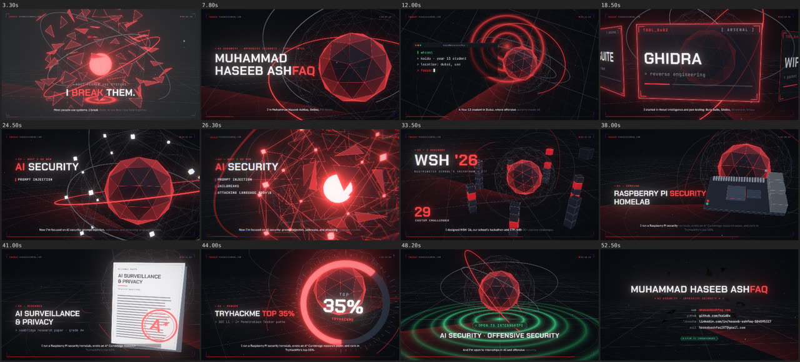
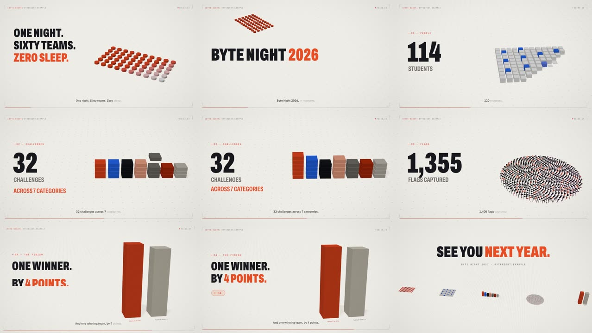
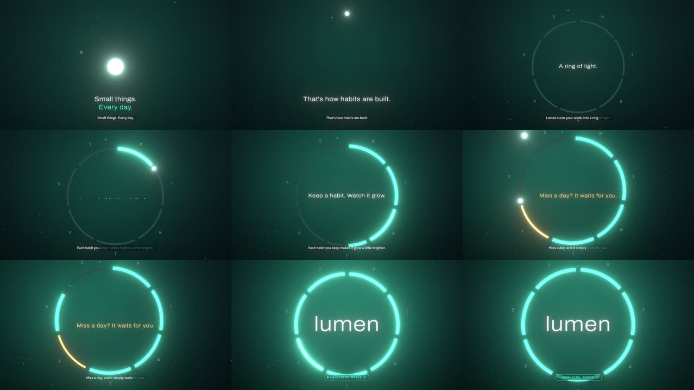
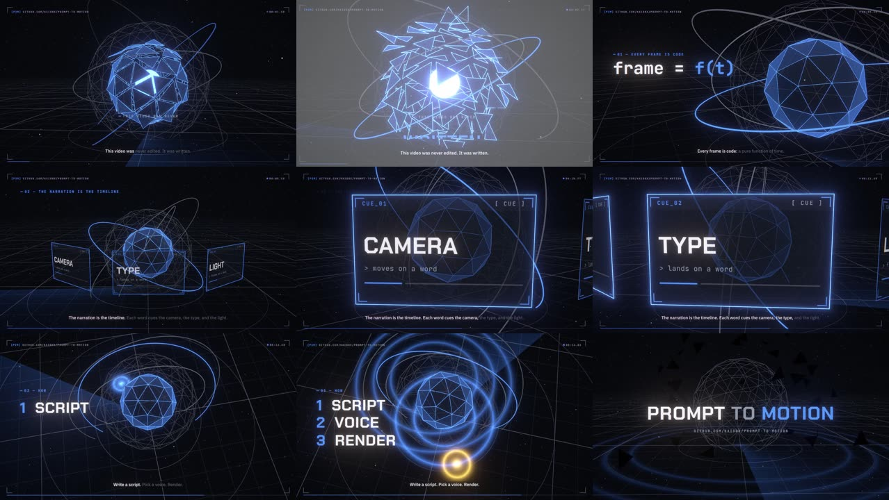
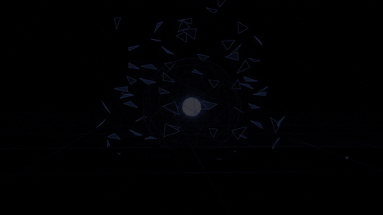

<div align="center">

# prompt-to-motion

**Describe a video in plain English. Get a narrated, word-synced, cinematic motion-graphics MP4, rendered from code.**

No After Effects, no timeline and no keyframes. The narration *is* the timeline: every spoken word cues the camera, the type, the 3D and the sound.

https://github.com/user-attachments/assets/84e68a30-6127-4abb-a6f5-9a05320a6d8f

<sub>▶ <b>lumen</b>: a 19-second launch teaser made with this repo from a short brief (voice, 3D, type and sound). More examples below.</sub>

</div>

---

## What it is

- **A Claude skill** (`skill/motion-video`) that takes Claude from a one-paragraph brief to a finished MP4: script → voice → word alignment → 3D scene → visual QA → render → sound design → size-capped export.
- **A renderer** built on three.js. Every frame is a pure function of time, so the browser preview, stills and the final export match frame for frame.
- **A kit** for 3D video plates: a cinematic camera rig, shattering objects, a radar floor, holo cards, glitch-decode type, a terminal, burned-in captions and a HUD, all keyed to *words* rather than seconds.
- **A local, free pipeline:** Kokoro TTS, CTC forced alignment, a synthesized music bed, a royalty-free SFX generator, and chunked, resumable rendering. You don't need any API keys.

## Examples

Four videos, four looks, one kit. Each is a folder in `projects/` plus one scene file in `app/src/scenes/`.

| | |
|---|---|
|  |  |
| **`portfolio-intro`** (54 s): a recruiter-facing personal intro. Dark "case file" look, a shattering core, an orbiting camera, holo cards and a node graph. Made from the prompt *"make a video about me using my website's colours, 30–60 s, male narration, cinematic camera, 3D"*. | **`byte-night`** (24 s): a light, editorial data story (fictional event). Paper palette, lit and shadowed blocks that build each stat (1,400 instanced flags), counters rolling up on their words, and a camera dollying down a street of stations. British voice. |
|  |  |
| **`lumen`** (19 s): a calm, premium launch teaser (fictional app). Gradient sky, bokeh, one hero object (a ring of seven days that fills habit by habit), a near-still camera and light centred type. Soft female voice. | **`starter`** (19 s): the smallest complete video, which explains the idea in its own words. Copy it to start a new one. |



## Quick start

Requirements: [bun](https://bun.sh), Python 3.10+, ffmpeg, Google Chrome.

```sh
git clone https://github.com/kaid0x/prompt-to-motion && cd prompt-to-motion
cd app && bun install && cd ..
pip install onnxruntime kokoro-onnx soundfile numpy scipy
python pipeline/get_models.py          # local TTS + aligner, CPU only
python pipeline/synth_sfx.py           # royalty-free SFX -> sfx/

# preview the example in the browser (space = play, ←/→ = seek)
cd app && bunx vite

# render it
cd .. && pipeline/render.sh projects/portfolio-intro && python pipeline/mix.py projects/portfolio-intro && pipeline/finish.sh projects/portfolio-intro
```

### With Claude (recommended)
Install the skill: copy `skill/motion-video/` into `~/.claude/skills/` (Claude Code), or upload the folder as a skill in Claude.
Open this repo and ask:

> Make a 40-second intro video for **yourwebsite.com** using its colours. Male narration, cinematic camera, 3D. It's for recruiters.

Claude writes `projects/<name>/script.json`, `brand.json` and a scene, then checks contact sheets of every beat before rendering and sends you the MP4. See [example prompts](skill/motion-video/references/prompts.md).

### By hand
```sh
cp -r projects/starter projects/my-video                 # edit script.json + brand.json
cp app/src/scenes/starter.ts app/src/scenes/my_video.ts  # set "plates": [["my_video", "hook"]]
python pipeline/tts.py projects/my-video                 # or drop your own audio/voiceover.mp3
python pipeline/align.py projects/my-video               # word timings
python pipeline/analyze_audio.py projects/my-video
cd app && PROJECT=projects/my-video bunx vite            # live preview while you edit the scene
PROJECT=projects/my-video bun scripts/render.ts sheet --times 2,5,9,14 --cols 4 --out ../sheet.png
cd .. && pipeline/render.sh projects/my-video && python pipeline/mix.py projects/my-video && pipeline/finish.sh projects/my-video
```

## How it works

```
script.json ──tts.py──▶ voiceover.mp3 ──align.py──▶ lyrics.json (every word: start, end)
                                                         │
brand.json ─▶ palette + fonts                            ▼
scene.ts:  build()  camera keys, type, objects  at WT('word') times
           update(t) everything as a pure function of t
                │
render.sh ─▶ headless Chrome renders frames ─▶ ffmpeg chunks ─▶ finish.sh ─▶ MP4 (size-capped)
                                                         ▲
sfx.json ──mix.py──▶ bed + sub hits + swells + SFX on words, ducked under the voice
```

A scene says *what happens on which word*:

```ts
// the core cracks open as the narrator says "break"
const tBreak = WT('break');
r.add(K(tBreak - 0.05, 82, 8.6, 0.45));                                   // camera arrives on the word
u.title([['I ', 'bone'], ['BREAK', 'signal'], [' THEM.', 'bone']], W / 2, 842, 92, tBreak - 0.05, M(5.45));
this.punches.push([tBreak + 0.02, 0.035]);                                // zoom punch
// update(t): explode = 0.62 * prog(t, tBreak, tBreak + 0.3, ease.outExpo)
```

Swap the voice and nothing breaks. Re-align, and every `WT()` moves with the new read. Literal times wrapped in `M()` are re-mapped word by word from the old read to the new one.

## Docs

- [**Skill**](skill/motion-video/SKILL.md): the full workflow Claude follows (and so can you)
- [Scene API](skill/motion-video/references/scene-api.md): Stage, camera, words, overlay, 3D blocks, project files, CLI
- [Do and don't](skill/motion-video/references/pitfalls.md): rules learned from real mistakes
- [Example prompts](skill/motion-video/references/prompts.md)
- [Troubleshooting](skill/motion-video/references/troubleshooting.md)

## Performance

Rendering runs WebGL in headless Chrome. On a CPU-only box (SwiftShader, 2 cores) the portfolio intro renders
at about **1 s per frame at 720p30**, so a 1-minute video takes ~25 min. With a GPU (Metal on Mac, D3D11 on Windows,
picked automatically) it's much faster, and 1080p60 with motion blur (`bun run render:hq`) becomes practical.

Renders are chunked and resumable (`pipeline/render.sh` skips finished chunks), so a crash or a sleeping laptop costs at most one chunk.

## Credits

- Rendering engine derived from [**pdoom-video**](https://github.com/mexicat/pdoom-video) by Giacomo Magnanini (MIT). The post-processing, typography system and headless exporter are his work; see [THIRD_PARTY.md](THIRD_PARTY.md).
- TTS: [Kokoro-82M](https://github.com/thewh1teagle/kokoro-onnx) (Apache-2.0). Alignment: wav2vec2-base-960h (Apache-2.0).
- Fonts: Chakra Petch, JetBrains Mono, IBM Plex, Archivo, Cormorant (SIL OFL).

Created by **Muhammad Haseeb Ashfaq** ([@kaid0x](https://github.com/kaid0x), [mhaseebashfaq.com](https://mhaseebashfaq.com)). MIT licence.
